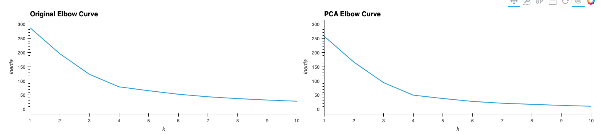
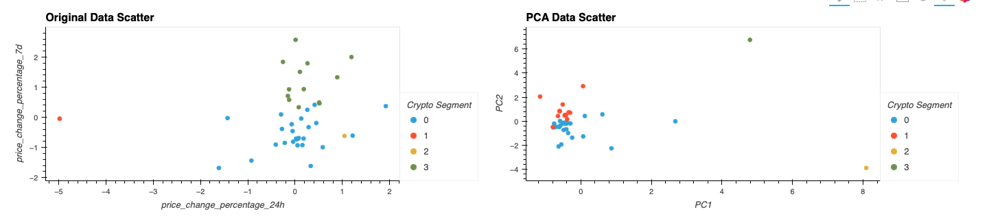

# Module 10 Challenge

In this Challenge, I am taking the role of an advisor at a financial advisory firm. I am assembling investment portfolios that are based on cryptocurrencies. Insead of basing my analysis on only returns and volatility, I am including Unsupervised Machine Learning. My results were created in a Jupyter Notebook that clusters cryptocurrenies by their performance in different time periods. The data used for this assignment is the crypto_market_data.csv file that is included on this page for review.

The steps for this Challenge are divided into the following sections:

* Import the Data

* Prepare the Data

* Find the Best Value for k Using the Original Data

* Cluster Cryptocurrencies with K-means Using the Original Data

* Optimize Clusters with Principal Component Analysis

* Find the Best Value for k Using the PCA Data

* Cluster the Cryptocurrencies with K-means Using the PCA Data

* Visualize and Compare the Results

## Technologies

The following modules were imported for this assignment:

*import pandas as pd

*import hvplot.pandas

*from pathlib import Path

*from sklearn.cluster import KMeans

*from sklearn.decomposition import PCA

*from sklearn.preprocessing import StandardScaler

## Usage

Composite diagrams were created to compare the original and PCA data (less components) for both the elbow data to find an optimal k value and the level on inertia. Please see below.

  
